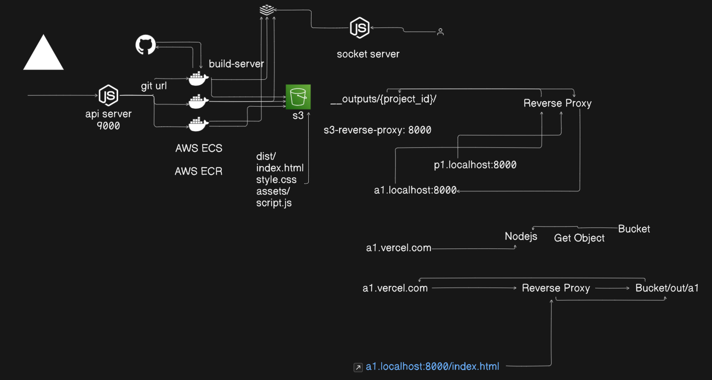

# Solace
A simple & easy-to-use cloud platform for deploying and hosting websites with API integration, build automation, and reverse proxy setup.

## Project Structure
This project contains the following services and folders:
- `api-server`: HTTP API Server for REST APIs
- `build-server`: Docker Image code which clones, builds, and pushes the build to S3
- `s3-reverse-proxy`: Reverse Proxy for subdomains and domains to S3 bucket static assets

## Local Setup
1. Run `npm install` in all three services: `api-server`, `build-server`, and `s3-reverse-proxy`.
2. Docker build the `build-server` and push the image to AWS ECR.
3. Setup the `api-server` by providing all the required configurations such as TASK ARN and CLUSTER ARN.
4. Run `node index.js` in `api-server` and `s3-reverse-proxy`.

### Running Services
The following services should be up and running:
| S.No | Service            | PORT    |
| ---- | ------------------ | ------- |
| 1    | `api-server`       | `:9000` |
| 2    | `socket.io-server` | `:9002` |
| 3    | `s3-reverse-proxy` | `:8000` |

## Architecture


### Basic Frontend

The frontend of the project is built using Next.js 

To get started with the frontend:
1. Run the development server:
    ```bash
    npm run dev
    # or
    yarn dev
    # or
    pnpm dev
    # or
    bun dev
    ```
2. Open [http://localhost:3000](http://localhost:3000) with your browser to see the result.
3. You can start editing the page by modifying `app/page.tsx`. The page auto-updates as you edit the file.

### Why I Built This Project

The project was built to replicate the functionality of Vercel, providing an easy-to-use user interface for deploying and managing web applications. The focus was on creating an intuitive and user-friendly experience that simplifies the complexities of deployment and hosting, making it accessible for developers of all skill levels.

### Conclusion

The Solace project showcases a robust and scalable architecture, integrating multiple services to deliver a seamless deployment experience. By leveraging technologies like Next.js, Docker, and AWS, the project demonstrates best practices in modern web development and deployment. The easy-to-use UI and the comprehensive setup guide make it a valuable resource for developers looking to understand and implement similar solutions.
